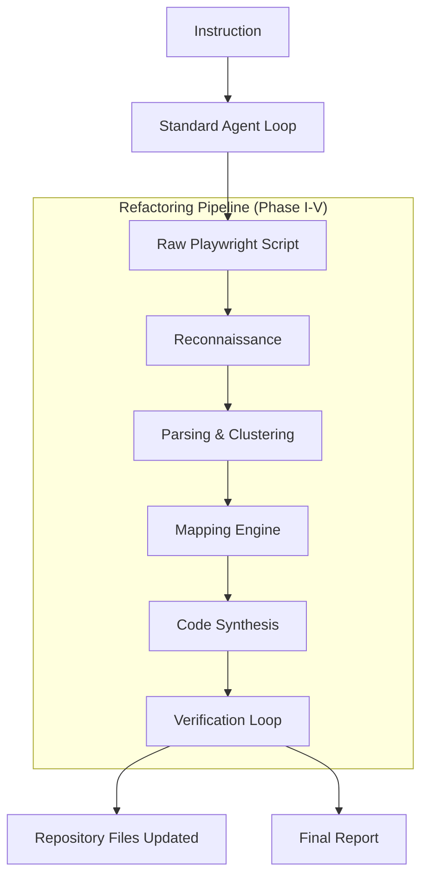

# QA Playwright Plugin

AI-powered Playwright QA testing from natural language instructions, now with E2E refactoring capabilities.

## Overview

This plugin transforms plain English instructions into production-ready Playwright tests. It operates in two modes:
1. **Standard Mode**: Generates a self-contained, raw Playwright script using an autonomous AI agent loop.
2. **Refactor Mode (New)**: Extends the standard mode by automatically integrating the generated code into an existing Page Object Model (POM) repository.

## Key Features

- **Autonomous Agent Loop**: Uses Gemini AI to drive a browser and self-correct based on real-time feedback.
- **5-Phase Refactoring Pipeline**: Transforms linear scripts into structured, maintainable POM code.
- **Chameleon Strategy**: Matches your repository's coding style (locator wrappers, visibility, naming conventions).
- **Verification Loop**: Automatically runs the integrated test and applies self-healing fixes for runtime failures.

## Installation

```bash
# Clone or copy the plugin
cd qa-playwright-plugin

# Install dependencies
bun install

# Build
bun run build

# Link globally (optional)
npm link
```

## Usage

### Prerequisites

You need a **Gemini API Key** to power the AI agent.

```bash
export GEMINI_API_KEY=your_api_key_here
```

### 1. Standard Mode (Raw Script Generation)

Generates a standalone `.spec.ts` file in your output directory.

```bash
# After building
./dist/bin/qa-test.js "Navigate to example.com and verify the heading"
```

### 2. E2E Refactor Mode (Repository Integration)

Generates raw code, analyzes your target repository, maps selectors to Page Objects, and creates/updates files.

```bash
# After building
./dist/bin/qa-test.js "Login and toggle theme" --refactor --repo ~/my-playwright-repo -l
```

### CLI Options

| Flag | Argument | Description |
|------|----------|-------------|
| `-o, --output` | `<dir>` | Output directory for artifacts (default: `~/qa-playwright-results`) |
| `-b, --base-url` | `<url>` | Base URL for relative paths |
| `-t, --timeout` | `<ms>` | Timeout in milliseconds (default: `300000` = 5 min) |
| `-l, --log` | | Enable verbose logging of agent progress to stderr |
| `-r, --refactor`| | **Enable E2E refactoring mode** |
| `--repo` | `<path>` | **Path to target Playwright repository** (required for refactor mode) |
| `--dry-run` | | Analyze without making changes (for refactor mode) |

## The Refactoring Pipeline

When `--refactor` is enabled, the tool executes a 5-phase pipeline:

### Phase I: Reconnaissance
Scans your repository to discover its structure (`pages/`, `tests/`, `fixture.ts`) and detect coding patterns (e.g., if you use a `WebControl` wrapper or `getByTestId` locator style).

### Phase II: Input Parsing
Tokenizes the raw Playwright output and clusters actions into semantic "intent chains" (e.g., "Authentication", "Form Submission", "Navigation").

### Phase III: Mapping Engine
Uses semantic keyword scoring and anchor inference to determine which Page Object should own each orphan selector generated by the AI.

### Phase IV: Code Synthesis
Generates style-matched properties and methods in your Page Objects and reconstructs the test file using your repository's custom fixtures.

### Phase V: Verification Loop
Executes your custom test setup. If it fails (e.g., due to timing or layout issues), it classifies the error and applies auto-fixes (adding weights, forcing clicks, etc.).

## Architecture



## How It Works: The Standalone Agentic Loop

This tool operates through an internal "Agentic Loop" powered by **Gemini AI** and **Playwright MCP**. It doesn't just "guess" code—it tries it in a real browser, sees if it works, and iterates until the instruction is completed.

Once successful, the "Refactoring Pipeline" takes over to ensure that code doesn't just work, but *fits* perfectly into your professional codebase.

## License

PolyForm Noncommercial License 1.0.0. See [LICENSE](LICENSE) for details.

