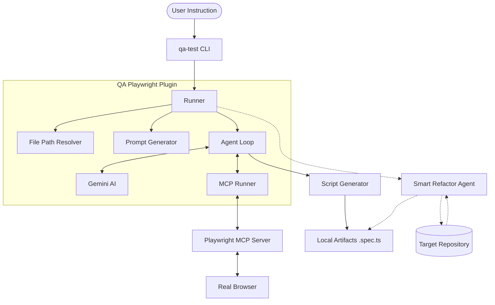

# QA Playwright Plugin

AI-powered Playwright QA testing from natural language instructions.

## Overview

This plugin allows you to run browser tests by simply describing what you want to test in plain English. It uses a standalone AI agent loop combined with Playwright MCP to:

1. Parse your test instructions into executable steps
2. Drive a browser using AI + Playwright
3. Generate reusable Playwright test scripts
4. **Smart Refactor**: Automatically refactor and integrate generated tests into an existing repository's Page Object Model (POM)
5. Output structured JSON results

## Prerequisites

### Install Bun

#### macOS / Linux
```bash
# Install Bun (recommended)
curl -fsSL https://bun.sh/install | bash

# Restart your terminal or run:
source ~/.bashrc
```

#### Windows (PowerShell)
```powershell
# Install Bun using PowerShell
irm bun.sh/install.ps1 | iex

# Restart PowerShell after installation
```

#### Alternative: Install via npm/yarn
```bash
# If you have npm/yarn already
npm install -g bun
# or
yarn global add bun
```

**Verify installation:**
```bash
bun --version
```

## Installation

```bash
# Clone or copy the plugin
cd qa-playwright-plugin

# Install dependencies
bun install

# Build
bun run build

# Link globally (optional)
npm link
```

## Usage

### Get Gemini API Key

1. Go to [Google AI Studio](https://makersuite.google.com/app/apikey)
2. Sign in with your Google account
3. Click "Create API Key"
4. Copy the generated API key

### Set API Key

#### Option 1: Environment Variable (temporary)
```bash
# macOS/Linux
export GEMINI_API_KEY="your_api_key_here"

# Windows (PowerShell)
$env:GEMINI_API_KEY="your_api_key_here"

# Windows (Command Prompt)
set GEMINI_API_KEY=your_api_key_here
```

#### Option 2: .env File (recommended)
Create a `.env` file in the project root:
```bash
GEMINI_API_KEY=your_api_key_here
```

The `.env` file will be automatically loaded when running the tool.

### Basic Usage

```bash
# Run with bun (development)
bun run dev "Navigate to example.com and verify the heading says 'Example Domain'"

# After building
./dist/bin/qa-test.js "Test instruction here"

# After npm link
qa-test "Test instruction here"
```

### CLI Options

```bash
qa-test "<instruction>" [options]

Options:
  -o, --output <dir>    Output directory for artifacts (default: ~/qa-playwright-results)
  -b, --base-url <url>  Base URL for relative paths
  -r, --target-repo <path> Path to existing repository for Smart Refactor and Integration
  -t, --timeout <ms>    Timeout in milliseconds (default: 300000)
  -l, --log             Enable verbose logging of agent progress to stderr
  -h, --help            Show help
```

## How It Works: The Standalone Agentic Loop

This tool operates through an internal "Agentic Loop":

### 1. The Architect (System Persona)
*   Defines the "QA Engineer" persona and strict fallback strategies (e.g., trying Role > Label > Text).
*   Orchestrates the session and manages inputs.

### 2. Local File Path Resolution
*   **Automatic Context Injection**: The runner automatically detects absolute file paths in your natural language instructions.
*   **Data Security/Ease**: It reads the contents of those files (e.g., `login.txt` with credentials) and injects them into the prompt environment, so the AI has the values without you needing to paste sensitive data into the command line.

### 3. The Agent Loop (The Intelligence & Dispatcher)
*   **Gemini AI**: Powers the reasoning engine that decides which actions to take.
*   **Automatic Feedback Loop**: When a browser action fails (e.g., "element not found"), the plugin automatically feeds that error back to the AI. This allows the AI to immediately rethink its next move based on real-time browser state.
*   **Tool Gateway**: Directly communicates with **Playwright MCP** via JSON-RPC to execute browser commands.

### 4. Verification & Script Composition
*   After every action, the AI verifies the result before moving to the next step.
*   Once finished, it compiles successful actions into a clean, production-ready Playwright script.

### 5. Smart Refactor & Integration (Optional)
*   If a `--target-repo` is provided, a second agent is spawned to:
    *   Explore your repository's structure (Page Objects, tests, fixtures).
    *   Refactor the "raw" generated script into your project's coding style and POM.
    *   Integrate the new test case and any required Page Object updates directly into your codebase.

## Generated Scripts

The plugin generates production-ready Playwright test code:

```typescript
import { test, expect } from '@playwright/test';

test('QA Test: Login flow', async ({ page }) => {
  await page.goto('https://example.com/login');
  await page.getByLabel('Email').fill('test@example.com');
  await page.getByRole('button', { name: 'Submit' }).click();
  await expect(page.getByText('Welcome')).toBeVisible();
});
```

You can run generated scripts with:

```bash
npx playwright test /path/to/generated.spec.ts
```

## Architecture

### ASCII Overview

```text
         [ 1. Input ]
              │
    ┌─────────▼────────────────────────┐
    │     CLI (qa-test)                │
    └─────────┬────────────────────────┘
              │ 2. Setup & Context
    ┌─────────▼────────────────────────┐
    │   QA Playwright Plugin           │
    │   (Strategy & File Resolver)     │
    └─────────┬────────────────────────┘
              │ 3. Agent Loop (Gemini)
    ┌─────────▼────────────────────────┐        ┌──────────────────┐
    │      Internal Dispatcher         │◄───────┤ Feedback Loop    │
    │   (Intelligence & Tool Calls)    │        │ (Errors/Results) │
    └─────────┬────────────────────────┘        └────────▲─────────┘
              │ 4. Tool Execution                        │
    ┌─────────▼────────────────────────┐        ┌────────┴─────────┐
    │      Playwright MCP              ├────────►  Test Reports    │
    │    (Browser Automation)          │        │     (JSON)       │
    └─────────┬───────────▲────────────┘        └──────────────────┘
              │           │                              │
              │ Actions   │ Selectors                    │ 5. Save
    ┌─────────▼───────────┴────────────┐        ┌────────┴─────────┐
    │       Real Browser               │        │  Local Artifacts │
    │   (Chrome/Firefox/Webkit)        │        │ (.spec.ts files) │
    └──────────────────────────────────┘        └──────────────────┘
              │                                          │
              │ (Optional Integration)                   ▼
    ┌─────────▼──────────────────────────────────────────────┐
    │      Smart Refactor Agent (Target Repo Integration)     │
    └────────────────────────────────────────────────────────┘
```

### Flow Diagram (Mermaid)


```mermaid
graph TD
    User([User Instruction]) --> CLI[qa-test CLI]
    CLI --> Runner[Runner]
    
    subgraph "QA Playwright Plugin"
        Runner --> FileResolve[File Path Resolver]
        Runner --> PromptGen[Prompt Generator]
        Runner --> AgentLoop[Agent Loop]
        
        AgentLoop <--> Gemini[Gemini AI]
        AgentLoop <--> MCP[MCP Runner]
    end
    
    MCP <--> PlaywrightMCP[Playwright MCP Server]
    PlaywrightMCP <--> Browser[Real Browser]
    
    AgentLoop --> ScriptGen[Script Generator]
    ScriptGen --> Output[Local Artifacts .spec.ts]
    
    Runner -.-> RefactorAgent[Smart Refactor Agent]
    RefactorAgent -.-> TargetRepo[(Target Repository)]
    TargetRepo -.-> RefactorAgent
    RefactorAgent -.-> Output
```

## License

PolyForm Noncommercial License 1.0.0. See [LICENSE](LICENSE) for details.
