# QA Playwright Plugin

AI-powered Playwright QA testing from natural language instructions.

## Table of Contents

1. [Overview](#overview)
2. [Architecture](#architecture)
3. [Technology Stack](#technology-stack)
4. [Component Breakdown](#component-breakdown)
5. [Data Flow](#data-flow)
6. [How It Works](#how-it-works)
7. [CLI Options](#cli-options)
8. [Generated Scripts](#generated-scripts)
9. [Environment Setup](#environment-setup)

---

## Overview

The **QA Playwright Plugin** is an intelligent testing tool that transforms natural language test instructions into executable browser automation tests. It combines:

- **AI-Powered Reasoning**: Uses Google Gemini to understand test instructions and decide on actions
- **Model Context Protocol (MCP)**: Bridges AI with Playwright's browser automation capabilities
- **Agentic Loop**: Continuous feedback loop that learns from browser state and adapts
- **Smart Refactoring**: Automatically integrates generated tests into existing Page Object Model (POM) repositories

### Core Capabilities

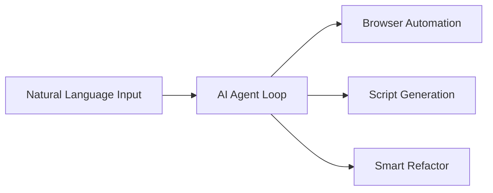
```mermaid
graph LR
    A[Natural Language Input] --> B[AI Agent Loop]
    B --> C[Browser Automation]
    B --> D[Script Generation]
    B --> E[Smart Refactor]
```

---

## Architecture

### High-Level System Architecture

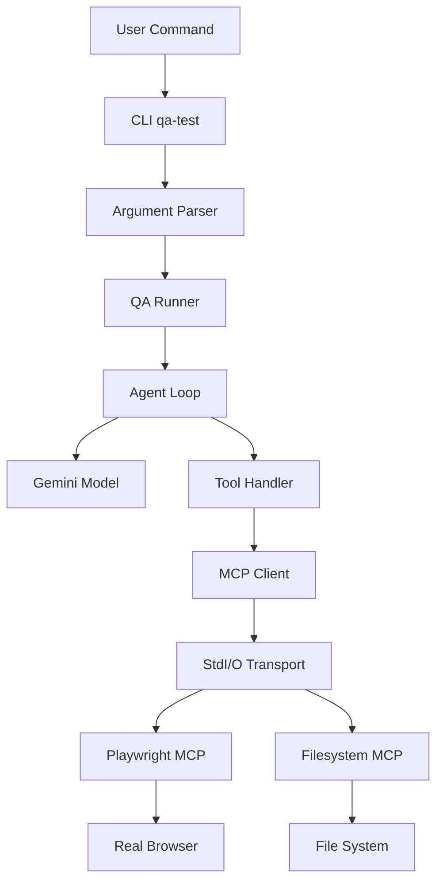
```mermaid
graph TB
    UI[User Command] --> CLI[CLI qa-test]
    CLI --> ARGS[Argument Parser]
    ARGS --> RUNNER[QA Runner]
    RUNNER --> AGENT[Agent Loop]
    AGENT --> GEMINI[Gemini Model]
    AGENT --> TOOLS[Tool Handler]
    TOOLS --> MCP[MCP Client]
    MCP --> TRANSPORT[StdI/O Transport]
    TRANSPORT --> PWSERVER[Playwright MCP]
    TRANSPORT --> FSSERVER[Filesystem MCP]
    PWSERVER --> BROWSER[Real Browser]
    FSSERVER --> FILES[File System]
```

---

## Technology Stack

### Core Dependencies

| Package | Purpose | Version |
|---------|---------|---------|
| `@google/generative-ai` | Gemini AI SDK for reasoning and decision making | ^0.21.0 |
| `@modelcontextprotocol/sdk` | MCP client implementation for tool bridging | ^1.0.4 |
| `dotenv` | Environment variable loading from .env files | ^16.4.7 |
| `picocolors` | Terminal color formatting | ^1.0.0 |

### Development Dependencies

| Package | Purpose |
|---------|---------|
| `bun-types` | TypeScript definitions for Bun runtime |
| `typescript` | Type checking and build tooling |

### External Services & Tools

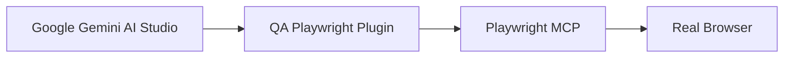
```mermaid
graph LR
    GEMINI[Google Gemini AI Studio] --> PLUGIN[QA Playwright Plugin]
    PLUGIN --> MCP[Playwright MCP]
    MCP --> BROWSER[Real Browser]
```

---

## Component Breakdown

### 1. CLI Entry Point (`bin/qa-test.ts`)

The CLI is the user-facing interface:

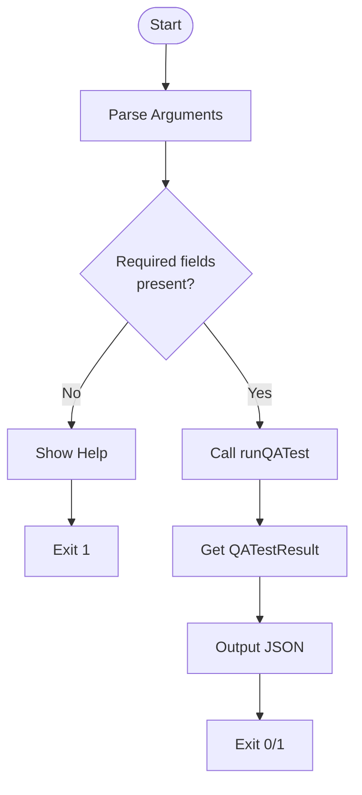
```mermaid
flowchart TD
    START([Start]) --> PARSE[Parse Arguments]
    PARSE --> VALID{Required fields<br/>present?}
    VALID -->|No| HELP[Show Help]
    HELP --> EXIT1[Exit 1]
    VALID -->|Yes| RUN[Call runQATest]
    RUN --> RESULT[Get QATestResult]
    RESULT --> OUTPUT[Output JSON]
    OUTPUT --> EXIT[Exit 0/1]
```

### 2. Core Runner (`src/runner.ts`)

The runner orchestrates the entire test execution:

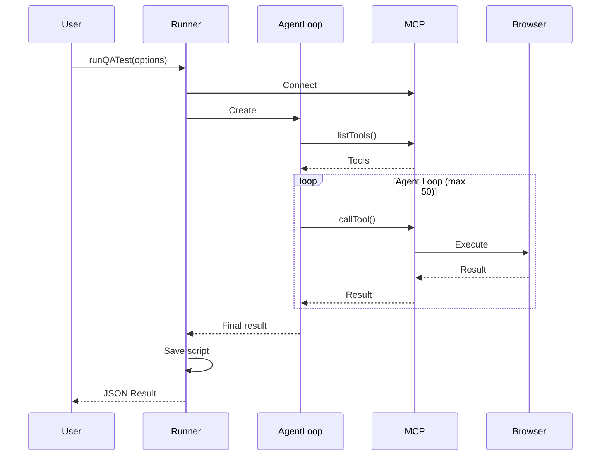
```mermaid
sequenceDiagram
    participant User
    participant Runner
    participant AgentLoop
    participant MCP
    participant Browser
    
    User->>Runner: runQATest(options)
    Runner->>MCP: Connect
    Runner->>AgentLoop: Create
    AgentLoop->>MCP: listTools()
    MCP-->>AgentLoop: Tools
    
    loop Agent Loop (max 50)
        AgentLoop->>MCP: callTool()
        MCP->>Browser: Execute
        Browser-->>MCP: Result
        MCP-->>AgentLoop: Result
    end
    
    AgentLoop-->>Runner: Final result
    Runner->>Runner: Save script
    Runner-->>User: JSON Result
```

### 3. QA Engineer Agent (`src/agent.ts`)

Defines the AI's persona and behavior:

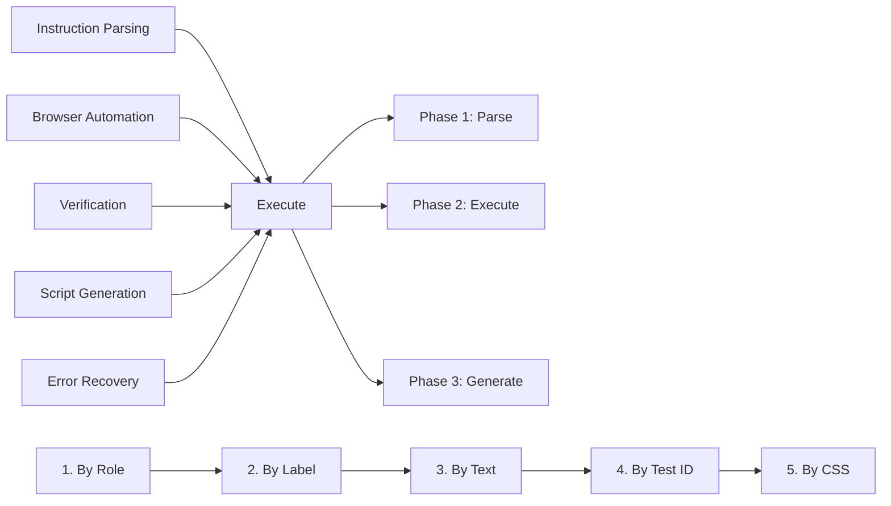
```mermaid
graph LR
    P[Instruction Parsing] --> EXEC[Execute]
    A[Browser Automation] --> EXEC
    V[Verification] --> EXEC
    S[Script Generation] --> EXEC
    R[Error Recovery] --> EXEC
    
    EXEC --> PHASE1[Phase 1: Parse]
    EXEC --> PHASE2[Phase 2: Execute]
    EXEC --> PHASE3[Phase 3: Generate]
    
    STRATEGY1[1. By Role] --> STRATEGY2[2. By Label]
    STRATEGY2 --> STRATEGY3[3. By Text]
    STRATEGY3 --> STRATEGY4[4. By Test ID]
    STRATEGY4 --> STRATEGY5[5. By CSS]
```

### 4. Agent Loop (`src/agent-loop.ts`)

The core AI orchestration engine:

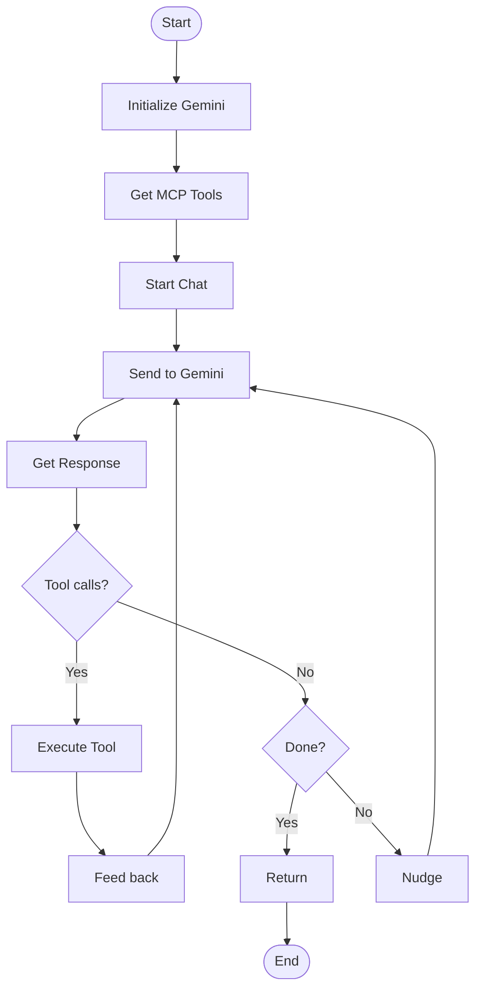
```mermaid
flowchart TD
    START([Start]) --> INIT[Initialize Gemini]
    INIT --> TOOLS[Get MCP Tools]
    TOOLS --> CHAT[Start Chat]
    
    CHAT --> SEND[Send to Gemini]
    SEND --> RESPONSE[Get Response]
    RESPONSE --> CHECK{Tool calls?}
    
    CHECK -->|Yes| EXEC[Execute Tool]
    EXEC --> FEED[Feed back]
    FEED --> SEND
    
    CHECK -->|No| END_CHECK{Done?}
    END_CHECK -->|Yes| RETURN[Return]
    END_CHECK -->|No| NUDGE[Nudge]
    NUDGE --> SEND
    
    RETURN --> FINISH([End])
```

### 5. MCP Runner (`src/mcp-runner.ts`)

Implements the Model Context Protocol client:

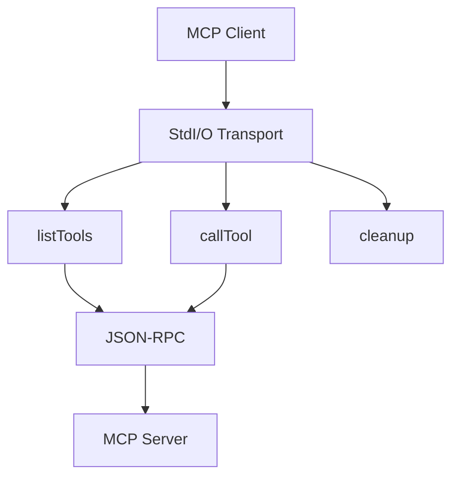
```mermaid
graph TD
    CLIENT[MCP Client] --> TRANSPORT[StdI/O Transport]
    TRANSPORT --> LIST[listTools]
    TRANSPORT --> CALL[callTool]
    TRANSPORT --> CLEAN[cleanup]
    
    LIST --> JSON[JSON-RPC]
    CALL --> JSON
    JSON --> SERVER[MCP Server]
```

### 6. Refactor Agent (`src/refactor-agent.ts`)

Handles POM integration:

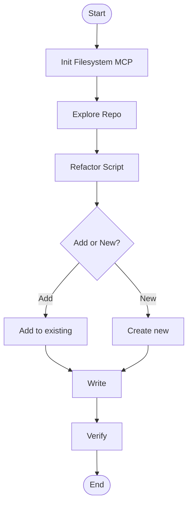
```mermaid
flowchart TD
    START([Start]) --> INIT[Init Filesystem MCP]
    INIT --> EXPLORE[Explore Repo]
    EXPLORE --> REFACTOR[Refactor Script]
    REFACTOR --> DECISION{Add or New?}
    
    DECISION -->|Add| EXISTING[Add to existing]
    DECISION -->|New| NEW[Create new]
    
    EXISTING --> WRITE[Write]
    NEW --> WRITE
    WRITE --> VERIFY[Verify]
    VERIFY --> END([End])
```

### 7. Output Module (`src/output.ts`)

Handles result formatting and parsing:

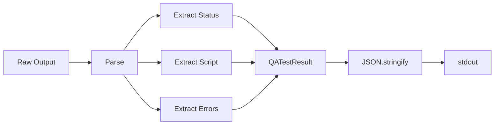
```mermaid
flowchart LR
    RAW[Raw Output] --> PARSE[Parse]
    PARSE --> STATUS[Extract Status]
    PARSE --> SCRIPT[Extract Script]
    PARSE --> ERRORS[Extract Errors]
    
    STATUS --> RESULT[QATestResult]
    SCRIPT --> RESULT
    ERRORS --> RESULT
    
    RESULT --> JSON[JSON.stringify]
    JSON --> OUT[stdout]
```

---

## Data Flow

### Complete Data Flow Diagram

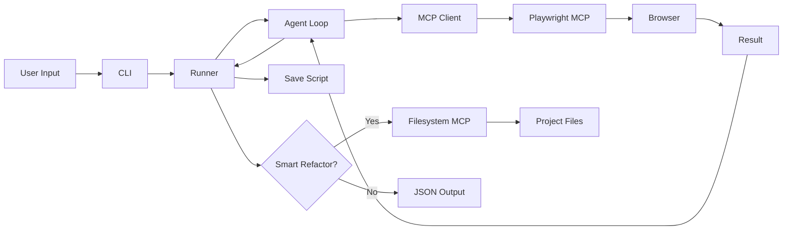
```mermaid
graph LR
    USER[User Input] --> CLI[CLI]
    CLI --> RUNNER[Runner]
    RUNNER --> AGENT[Agent Loop]
    AGENT --> MCP[MCP Client]
    MCP --> PWSERVER[Playwright MCP]
    PWSERVER --> BROWSER[Browser]
    
    BROWSER --> RESULT[Result]
    RESULT --> AGENT
    AGENT --> RUNNER
    
    RUNNER --> SCRIPT[Save Script]
    RUNNER --> REFACTOR{Smart Refactor?}
    REFACTOR -->|Yes| FSSERVER[Filesystem MCP]
    FSSERVER --> PROJECT[Project Files]
    REFACTOR -->|No| OUTPUT[JSON Output]
```

### Message Flow in Agent Loop

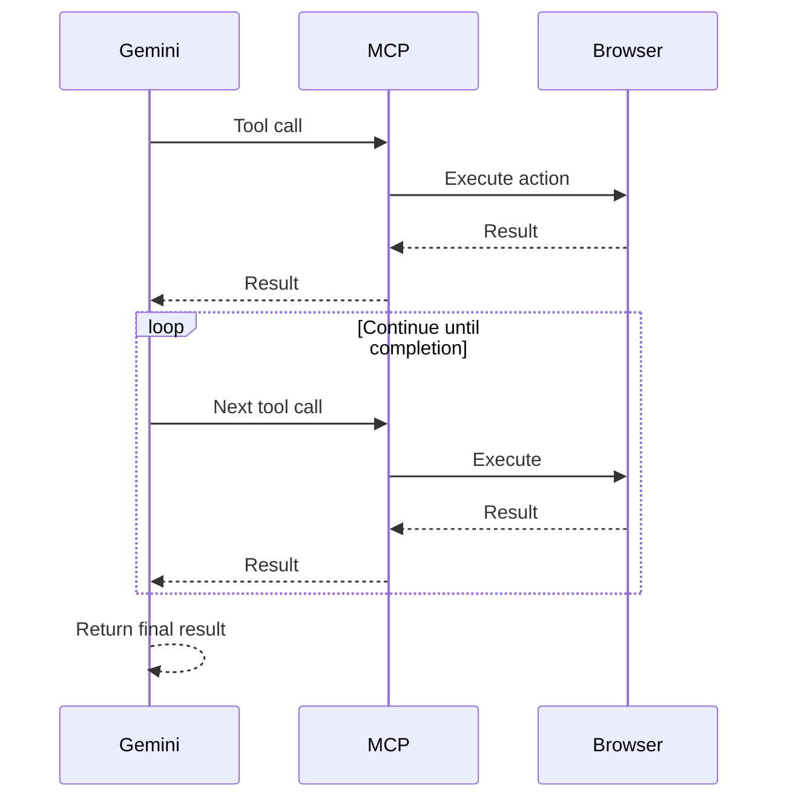
```mermaid
sequenceDiagram
    participant Gemini
    participant MCP
    participant Browser
    
    Gemini->>MCP: Tool call
    MCP->>Browser: Execute action
    Browser-->>MCP: Result
    MCP-->>Gemini: Result
    
    loop Continue until completion
        Gemini->>MCP: Next tool call
        MCP->>Browser: Execute
        Browser-->>MCP: Result
        MCP-->>Gemini: Result
    end
    
    Gemini-->>Gemini: Return final result
```

---

## How It Works

### Step-by-Step Execution

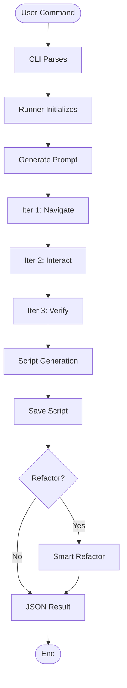
```mermaid
flowchart TD
    START([User Command]) --> STEP1[CLI Parses]
    STEP1 --> STEP2[Runner Initializes]
    STEP2 --> STEP3[Generate Prompt]
    STEP3 --> ITER1[Iter 1: Navigate]
    ITER1 --> ITER2[Iter 2: Interact]
    ITER2 --> ITER3[Iter 3: Verify]
    ITER3 --> STEP4[Script Generation]
    STEP4 --> STEP5[Save Script]
    STEP5 --> CHECK{Refactor?}
    
    CHECK -->|Yes| REFACTOR[Smart Refactor]
    CHECK -->|No| OUTPUT[JSON Result]
    REFACTOR --> OUTPUT
    
    OUTPUT --> END([End])
```

---

## CLI Options

| Option | Alias | Description | Default |
|--------|-------|-------------|---------|
| `--output` | `-o` | Output directory for artifacts | `~/qa-playwright-results` |
| `--base-url` | `-b` | Base URL for relative paths | (none) |
| `--target-repo` | `-r` | Path to existing repository for Smart Refactor | (none) |
| `--timeout` | `-t` | Timeout in milliseconds | `300000` (5 minutes) |
| `--log` | `-l` | Enable verbose logging | `false` |
| `--help` | `-h` | Show help message | - |

### Usage Examples

```bash
# Basic test
qa-test "Navigate to example.com and verify the heading"

# With base URL
qa-test "Test login flow" --base-url https://staging.myapp.com

# With output directory
qa-test "Test checkout" -o /tmp/my-tests

# With Smart Refactor
qa-test "Test login" -r /path/to/my-playwright-project

# Verbose mode
qa-test "Test search" --log

# Custom timeout
qa-test "Complex test" -t 600000
```

---

## Generated Scripts

### Example Output

```typescript
// Generated test.spec.ts
import { test, expect } from '@playwright/test';

test('QA Test: Verify h1 heading', async ({ page }) => {
  await page.goto('https://example.com');
  await expect(page.locator('h1')).toHaveText('Example Domain');
});
```

### After Smart Refactoring

```typescript
// Refactored to match project patterns
import { test, expect } from '@playwright/test';
import { HomePage } from './pages/HomePage';

test.describe('Home Page Tests', () => {
  test('should display correct heading', async ({ page }) => {
    const homePage = new HomePage(page);
    await homePage.goto();
    await expect(homePage.heading).toHaveText('Example Domain');
  });
});
```

---

## Environment Setup

### Prerequisites

1. **Bun Runtime** (required)
```bash
# macOS/Linux
curl -fsSL https://bun.sh/install | bash

# Windows (PowerShell)
irm bun.sh/install.ps1 | iex

# Verify
bun --version
```

2. **Gemini API Key** (required)
   - Get from: https://makersuite.google.com/app/apikey
   - Set via: `export GEMINI_API_KEY="your_key"`

### Installation

```bash
# Clone or copy the plugin
cd qa-playwright-plugin

# Install dependencies
bun install

# Build
bun run build

# Optional: Link globally
npm link
```

---

## License

PolyForm Noncommercial License 1.0.0. See [LICENSE](LICENSE) for details.